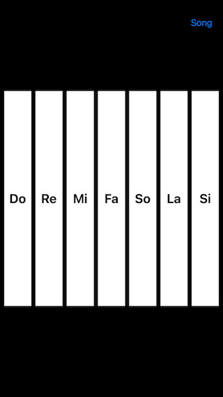

# WWSimplifiedMusicalNotationPlayer

[](https://developer.apple.com/swift/) [](https://developer.apple.com/swift/)  [](https://developer.apple.com/swift/) [](https://developer.apple.com/swift/)

## [Introduction - 簡介](https://swiftpackageindex.com/William-Weng)
- [Simplified musical notation player.](https://medium.com/彼得潘的-swift-ios-app-開發問題解答集/使用-ai-製作的-simplepianosynthesizer-彈鋼琴-4657a94e14a1)
- [簡譜播放器。](https://william-weng.github.io/2025/01/eop簡譜大師讓我們一起成為大師吧/)



## [Installation with Swift Package Manager](https://medium.com/彼得潘的-swift-ios-app-開發問題解答集/使用-spm-安裝第三方套件-xcode-11-新功能-2c4ffcf85b4b)

```bash
dependencies: [
    .package(url: "https://github.com/William-Weng/WWSimplifiedMusicalNotationPlayer.git", .upToNextMajor(from: "1.0.1"))
]
```

### [Function - 可用函式](https://ezgif.com/video-to-webp)
|函式|功能|
|-|-|
|playNote(_:duration:pedalOnDuration:)|播放簡譜音符|
|playNote(frequency:duration:pedalOnDuration:)|播放頻率聲音|
|playSong(_ song:duration:pedalOnDuration:result:)|播放簡譜|
|pedal(on:)|踏板控制方法|

## Example
```swift
import UIKit
import WWSimplifiedMusicalNotationPlayer

final class ViewController: UIViewController {
    
    @IBOutlet var notes: [UIView]!
    
    private let player = WWSimplifiedMusicalNotationPlayer()
    private let notation = "1 1 5 5 6 6 5 0 4 4 3 3 2 2 1 0 5 5 4 4 3 3 2 0 5 5 4 4 3 3 2 0 1 1 5 5 6 6 5 0 4 4 3 3 2 2 1~"
    
    override func viewDidLoad() {
        super.viewDidLoad()
        initSetting()
    }
    
    @IBAction func playDemo(_ sender: UIBarButtonItem) {
        player.playSong(notation)
    }
}

private extension ViewController {
    
    func initSetting() {
                
        notes.forEach {
            let tap = UITapGestureRecognizer(target: self, action: #selector(playNote))
            $0.isUserInteractionEnabled = true
            $0.addGestureRecognizer(tap)
        }
    }
    
    @objc func playNote(_ tap: UITapGestureRecognizer) {
        guard let note = tap.view?.tag else { return }
        _ = player.playNote("\(note)")
    }
}
```
